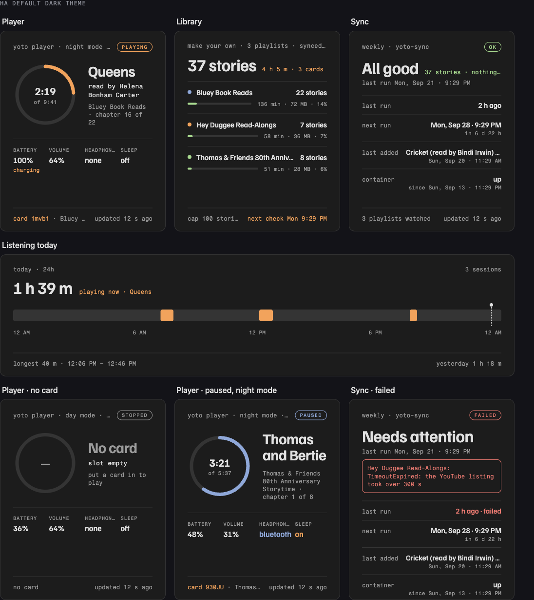
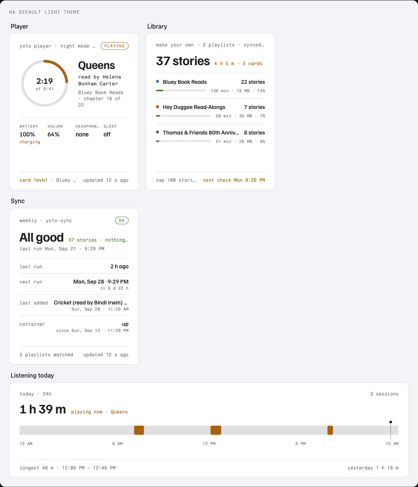

# Yoto Cards

Four custom Lovelace cards for Home Assistant that show what a Yoto player is doing, what is on
its Make-Your-Own cards, and whether the story sync that fills them is healthy. They share the
visual language of [Sun Cards](https://github.com/tkamenick/lovelace-sun-cards) and
[Air Quality Cards](https://github.com/tkamenick/lovelace-air-quality-cards): the same
typography, theme-aware surfaces, restrained accents, and one strong visual hierarchy per card.



The cards adapt their accents for light themes:



| Card | Type | What it answers |
|---|---|---|
| **Player** | `custom:yoto-cards-player` | What is playing, how far through it, from which card; battery, volume, headphones, sleep timer, night mode |
| **Library** | `custom:yoto-cards-library` | Which playlists the sync maintains, how many stories each holds, and how close each is to Yoto's 100-track / 500 MB card cap |
| **Sync** | `custom:yoto-cards-sync` | Did the weekly sync run, did it fail and why, what did it add last, when is the next run |
| **Listening** | `custom:yoto-cards-listening` | When the player was playing today, for how long, and how that compares to yesterday (recorder-backed) |

All four are dependency-free and bundled in one file. Clicking a reading opens Home Assistant's
normal more-info dialog.

## What they read

The cards are built for the entities that [yoto-sync](https://github.com/tkamenick/yoto-sync)
publishes over MQTT discovery:

- **Yoto Player** device from the `yoto-mqtt` bridge: `sensor.yoto_player_playback`,
  `_now_playing`, `_track`, `_chapter`, `_position`, `_track_length`, `_battery`, `_volume`,
  `_card`, `_firmware` and `binary_sensor.yoto_player_charging`, `_headphones`,
  `_bluetooth_headphones`, `_card_inserted`, `_day_mode`, `_sleep_timer`.
- **Yoto sync** device from `status.py`: `binary_sensor.yoto_sync_problem` (attributes
  `reason`, `status`), `sensor.yoto_sync_status`, `_last_run`, `_next_run`, `_last_added`,
  `_stories`, and one sensor per playlist whose attributes carry `title`, `minutes`, `mb`,
  `card_id`, `known` and `missing`.

Any other source works as long as the entity ids are passed in (below). A missing or
unavailable entity produces a clean fallback ("No card", "Offline", "—"), never a broken card.

## Install with HACS

1. HACS → three-dot menu → **Custom repositories**
2. Repository: `https://github.com/tkamenick/lovelace-yoto-cards` · Type: **Dashboard**
3. Install **Yoto Cards**, then reload the browser when prompted.

For a manual install, copy `yoto-cards.js` to `/config/www/` and add `/local/yoto-cards.js` as
a JavaScript module dashboard resource.

## Configuration

### Player

```yaml
type: custom:yoto-cards-player
player: yoto_player          # entity id prefix; sensor.<player>_playback and so on
name: Yoto Mini              # optional, the eyebrow; default: the device name
entities:                    # optional per-entity overrides
  playback: sensor.yoto_player_playback
  position: sensor.yoto_player_position
playlists:                   # optional; default: every sensor with a card_id attribute
  - sensor.yoto_sync_bluey_book_reads
```

The keys `entities` accepts: `playback`, `now_playing`, `track`, `chapter`, `position`,
`track_length`, `battery`, `charging`, `volume`, `headphones`, `bluetooth`, `card`,
`card_inserted`, `day_mode`, `sleep_timer`, `firmware`. The playlist sensors are used to turn
a card id into a playlist name and "chapter 16 of 22".

### Library

```yaml
type: custom:yoto-cards-library
playlists:                   # optional; default: every sensor with a card_id attribute
  - entity: sensor.yoto_sync_bluey_book_reads
    name: Bluey              # optional
    color: blue              # optional: blue, amber, green, pink, red
stories: sensor.yoto_sync_stories
next_run: sensor.yoto_sync_next_run
cap_mb: 500                  # Yoto's per-card limits, for the fill bars
cap_stories: 100
```

The fill bar is green under 60 % of either cap, amber to 80 %, red above.

### Sync

```yaml
type: custom:yoto-cards-sync
problem: binary_sensor.yoto_sync_problem
status: sensor.yoto_sync_status
last_run: sensor.yoto_sync_last_run
next_run: sensor.yoto_sync_next_run
last_added: sensor.yoto_sync_last_added
stories: sensor.yoto_sync_stories
container: binary_sensor.negroni_container_yoto_sync   # optional; omit to drop the row
name: weekly · yoto-sync
```

### Listening

```yaml
type: custom:yoto-cards-listening
playback: sensor.yoto_player_playback
now_playing: sensor.yoto_player_now_playing
refresh_interval: 300        # seconds between recorder reads; a playback change reads at once
grid_options:
  columns: full
```

It reads `history/history_during_period` for the playback sensor from yesterday's midnight
to now, so the sensor has to be recorded. Gaps under a minute inside a session are treated as
one session.

See [`examples/yoto-view.yaml`](examples/yoto-view.yaml) for a complete three-column sections
dashboard.

## Development

`dev/harness.html` renders every card on the dark and light themes with a fake `hass`
(serve the repo over HTTP and open it). `node dev/test.mjs` checks the helpers and each card's
rendering, including the no-card, offline and failed states.

## License

MIT
